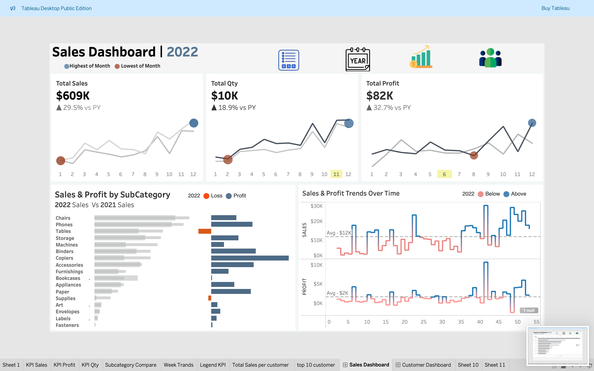
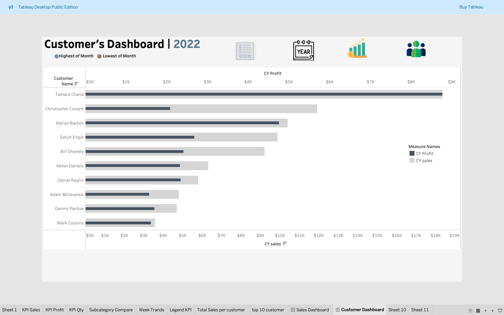
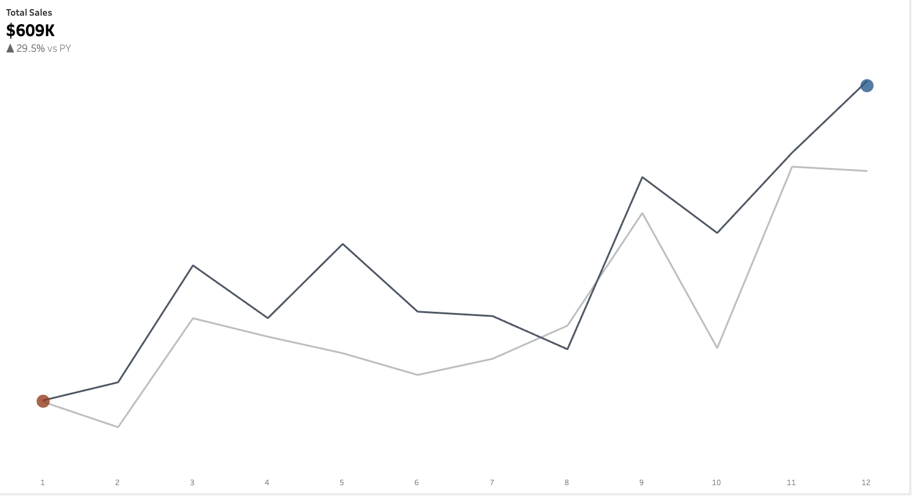
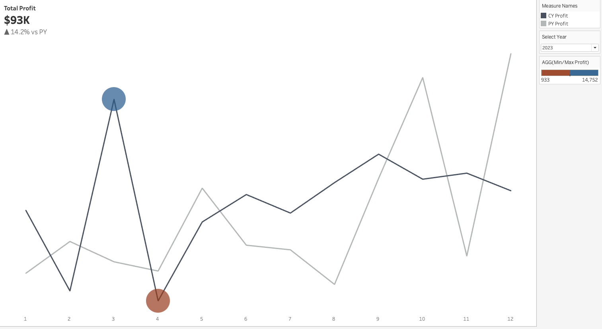
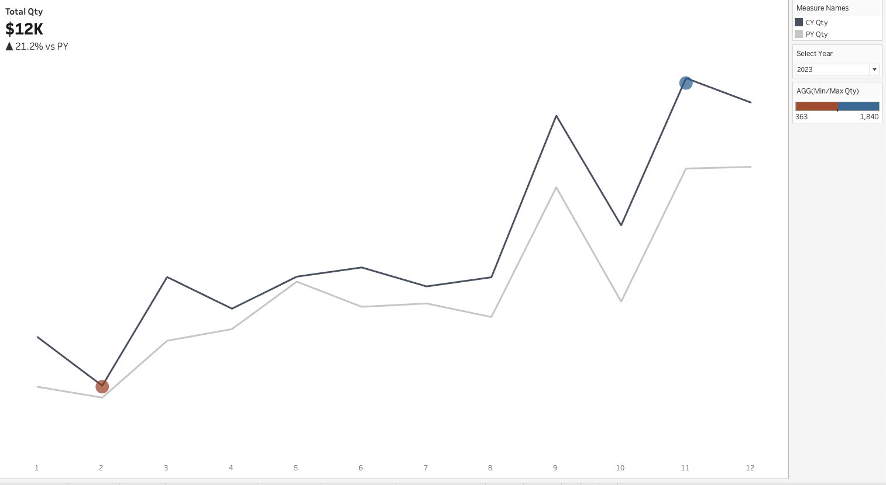
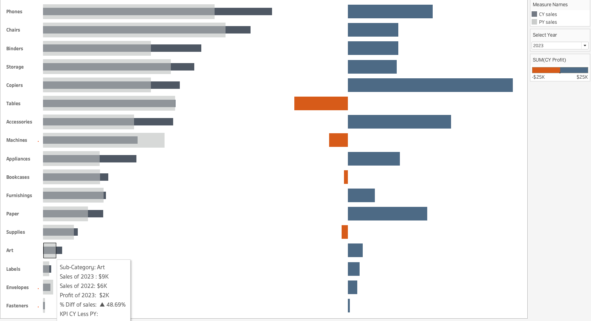
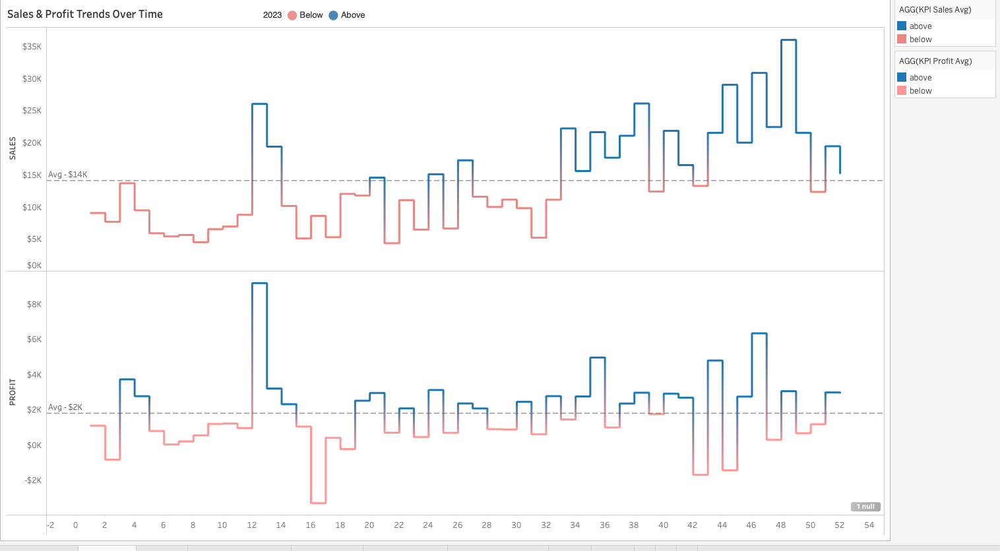
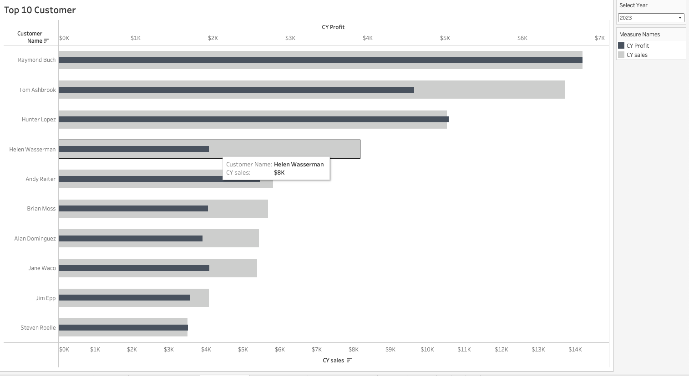

# 🚀 **Sales Dashboard Project** 🚀

---

## 📊 **Sales Dashboard**  
The **Sales Dashboard** provides a comprehensive view of the key performance indicators (KPIs) for:  
- Sales  
- Profit  
- Quantity  

It includes:  
1. **Subcategory Comparisons**  
2. **Weekly Trends**  

---

## 📈 **Customer Dashboard**  
The **Customer Dashboard** focuses on customer-specific insights:  
- Top 10 customers  

This helps businesses identify high-value customers and analyze their performance.  

---

## 🗂️ **Data Sources**  

The following datasets were used to build the dashboards:  

| **File Name**      | **Description**                         |
|---------------------|-----------------------------------------|
| **Products.csv**    | Contains product-level details         |
| **Orders.csv**      | Sales transactions and order details   |
| **Location.csv**    | Location-specific information          |
| **Customers.csv**   | Customer information and demographics  |

---

## 📑 **Sheets Created**  

| **Sheet Name**               | **Purpose**                                           | **Screenshot**                     |
|-------------------------------|-------------------------------------------------------|------------------------------------|
| **KPI Sales**                | Visualizes total sales metrics                        |  |
| **KPI Profit**               | Highlights profit KPIs                                |  |
| **KPI Qty**                  | Displays quantity-related KPIs                        |  |
| **Subcategory Compare**      | Compares sales performance across subcategories       |  |
| **Week Trends**              | Analyzes weekly sales and profit trends               |  |
| **Top 10 Customers**         | Displays top 10 customers based on sales performance  |  |

---

## 🧮 **Calculated Fields**  

### **Yearly KPIs**  
- **CY Customer** *(Current Year Customer)*  
- **PY Customer** *(Previous Year Customer)*  
- **CY Profit** *(Current Year Profit)*  
- **CY Qty** *(Current Year Quantity)*  
- **CY Sales** *(Current Year Sales)*  
- **PY Profit** *(Previous Year Profit)*  
- **PY Qty** *(Previous Year Quantity)*  
- **PY Sales** *(Previous Year Sales)*  

### **Year Filters**  
- **Current Year**  
- **Previous Year**  

### **Differences (YoY Comparison)**  
- **Diff of Profit**  
- **Diff of Qty**  
- **Diff of Sales**  

### **Min/Max Metrics**  
- **Min/Max Profit**  
- **Min/Max Qty**  
- **Min/Max Sales**  

### **Dynamic Filtering**  
- **Select Year**  

---

## 📷 **Screenshots Placement**  

1. **Sales Dashboard**  
     

2. **Customer Dashboard**  
     

3. **KPI Sales**  
     

4. **KPI Profit**  
     

5. **KPI Qty**  
     

6. **Subcategory Compare**  
     

7. **Week Trends**  
     

8. **Top 10 Customers**  
     

---

## 💡 **Comments and Suggestions**  

- Place all screenshots under their respective headings for clarity.  
- Use **"Select Year"** filters for dynamic insights.  
- Add tooltips in Tableau to explain calculated fields like **CY Sales** and **Diff of Profit**.  
- Highlight KPIs with **color-coded legends** for easier interpretation.  

---

## 🏁 **Conclusion**  

The **Sales Dashboard** and **Customer Dashboard** effectively analyze year-over-year sales performance, profit trends, and customer data. By leveraging calculated fields, these dashboards provide dynamic insights for decision-makers.  

---

  
    🏆 **Created with Tableau for Advanced Data Analysis** 🏆  

